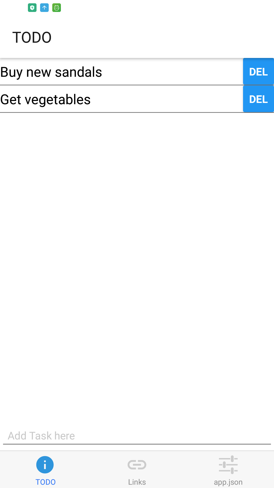

# TODO app using react native

This repository contains the  basic code on how to use react native.

I am building a basic todo app inspired from -> https://codeburst.io/todo-app-with-react-native-f889e97e398e
## Download apk
Android: https://exp-shell-app-assets.s3-us-west-1.amazonaws.com/android%2F%40kaneki993%2FTodo-App-f004d923-4f54-11e8-bd4d-0a580a781f14-signed.apk
iOS: I don't have a mac

## Example 

## Dependecies
expo 
react
react-native 